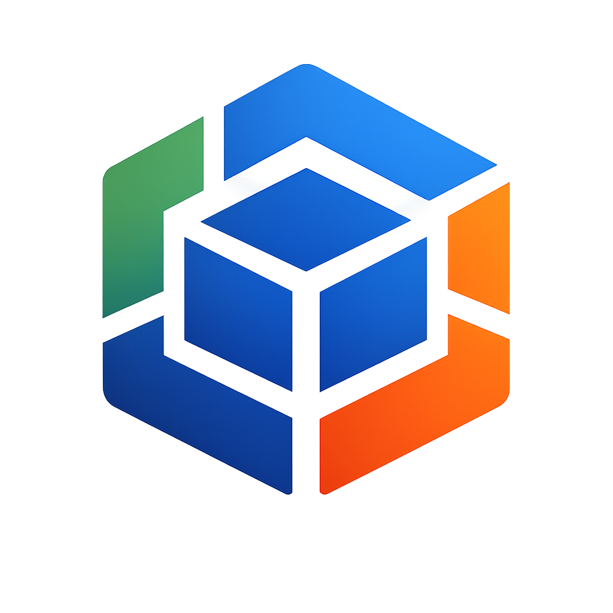

# OKE — OpenKubes Kubernetes Engine

<p align="center">
  
</p>

<p align="center">
  <strong>A Kubernetes distribution that runs on any Linux — with ok-linux as the native, optimized platform.</strong>
</p>

<p align="center">
  <a href="https://github.com/openkubes/oke/releases"></a>
  <a href="https://github.com/openkubes/oke/actions/workflows/build.yaml"></a>
  <a href="LICENSE"></a>
</p>

---

> **OKE works everywhere. OKE + ok-linux works perfectly.**

OKE is a lean, community-driven Kubernetes distribution based on a [RKE2](https://github.com/rancher/rke2) fork.
It is its own product — not "RKE2 with extras". Like K3s never says "we are a Kubernetes fork" — OKE is just OKE.

## Install

```bash
# Any Linux (Ubuntu, Debian, RHEL, ...)
curl -sfL https://get.openkubes.ai | sh -s - server

# With ok-linux auto-detection (enables KubeVirt, eBPF, GPU)
curl -sfL https://get.openkubes.ai | OKE_NATIVE=auto sh -s - server

# Join a worker node
curl -sfL https://get.openkubes.ai | \
  OKE_URL=https://<server-ip>:9345 \
  OKE_TOKEN=<token> \
  sh -s - agent
```

## OS Support

| OS | Support | KubeVirt | GPU | Atomic Updates |
|---|---|---|---|---|
| **ok-linux** | ✅ Native | Pre-configured | First-class | A/B partition |
| Ubuntu 22.04+ | ✅ Full | Manual | Manual | No |
| Debian 12+ | ✅ Full | Manual | Manual | No |
| RHEL / Rocky | 🤝 Community | Manual | Manual | No |
| Any Linux | 🤝 Best-effort | Manual | Manual | No |

## What OKE changes vs RKE2

| Component | RKE2 | OKE |
|---|---|---|
| Default CNI | Canal | **Cilium** |
| KubeVirt | Not included | Optional (pre-configured on ok-linux) |
| GPU operator | Not included | Optional (pre-configured on ok-linux) |
| Ingress | nginx | None (user choice) |
| Update model | OS + K8s separately | **Atomic A/B** on ok-linux |
| Config path | `/etc/rancher/rke2/` | `/etc/openkubes/oke/` |

## Architecture

```
┌─────────────────────────────────────────────────────┐
│                 OpenKubes Platform                   │
│      Crossplane · CAPI · KubeVirt · MetalLB         │
├─────────────────────────────────────────────────────┤
│                      OKE                             │
│          Kubernetes Distribution                     │
│          (RKE2 fork + OpenKubes APIs)               │
├───────────────────────┬─────────────────────────────┤
│      ok-linux         │   Ubuntu / Debian / RHEL    │
│  Native · Optimized   │   Fully supported           │
│  First-class          │   Community support         │
├───────────────────────┴─────────────────────────────┤
│              Hardware / Cloud                        │
│    Hetzner Bare Metal · AWS · Edge · Proxmox        │
└─────────────────────────────────────────────────────┘
```

## Quick Start (Ubuntu 22.04)

```bash
# Install OKE server
curl -sfL https://get.openkubes.ai | sh -s - server

# Check status
systemctl status oke-server
journalctl -u oke-server -f

# Get node token (for joining workers)
cat /var/lib/openkubes/oke/server/node-token

# Use kubectl
export KUBECONFIG=/etc/openkubes/oke/oke.yaml
kubectl get nodes
```

## Migration from RKE2

OKE is API-compatible with RKE2. Migration is a drop-in replacement:

```bash
# Step 1: Install OKE on existing Ubuntu nodes
curl -sfL https://get.openkubes.ai | sh -s - server

# Step 2: Verify workloads — fully API-compatible

# Step 3 (optional): Migrate to ok-linux one node at a time
ok-boot hetzner --node <node> --image ok-linux:v1.0.0
```

## Related Projects

| Project | Description |
|---|---|
| [ok-linux](https://github.com/openkubes/ok-linux) | Native OS for OKE — Ubuntu-based, immutable, KubeVirt-ready |
| [ok-rke2](https://github.com/openkubes/ok-rke2) | Ansible role — production bridge until OKE is ready |
| [ok-local](https://github.com/openkubes/ok-local) | Local dev environment (K3s + Multipass) |
| [openkubes](https://github.com/openkubes/openkubes) | Platform layer (Crossplane, CAPI, KubeVirt) |

## Documentation

- [Architecture](docs/architecture.md)
- [OS Support Model](docs/architecture.md#os-support-model)
- [Migration Path](docs/architecture.md#migration-path)

## License

Apache 2.0 — see [LICENSE](LICENSE)

---

<p align="center">
  Built with ❤️ by the <a href="https://github.com/openkubes">OpenKubes</a> community
</p>
